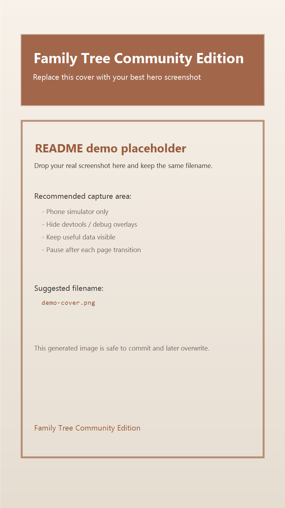
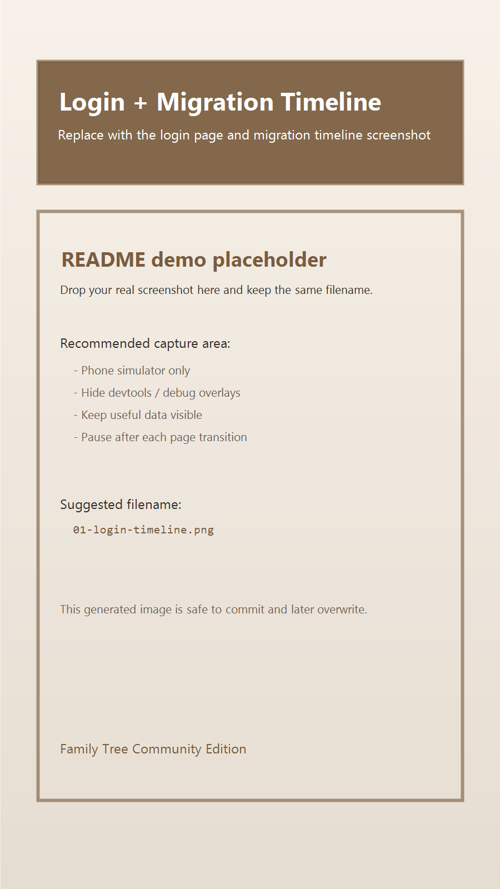
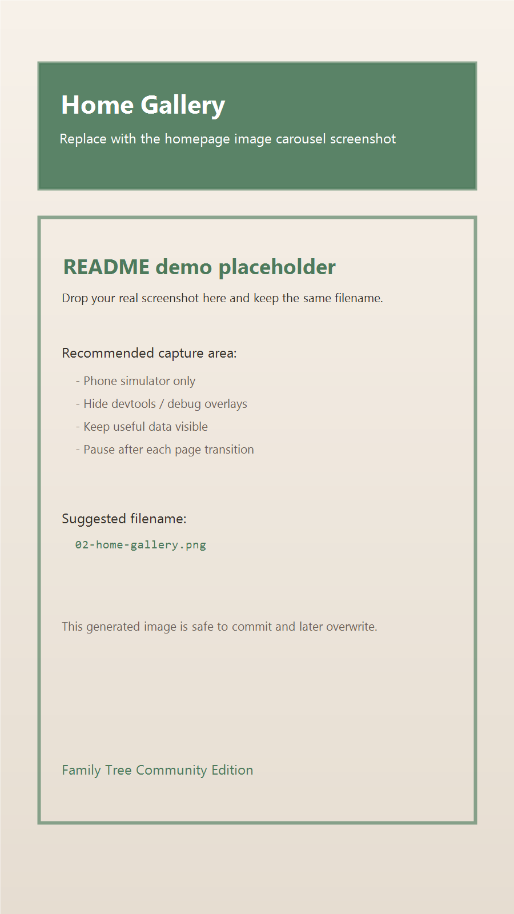
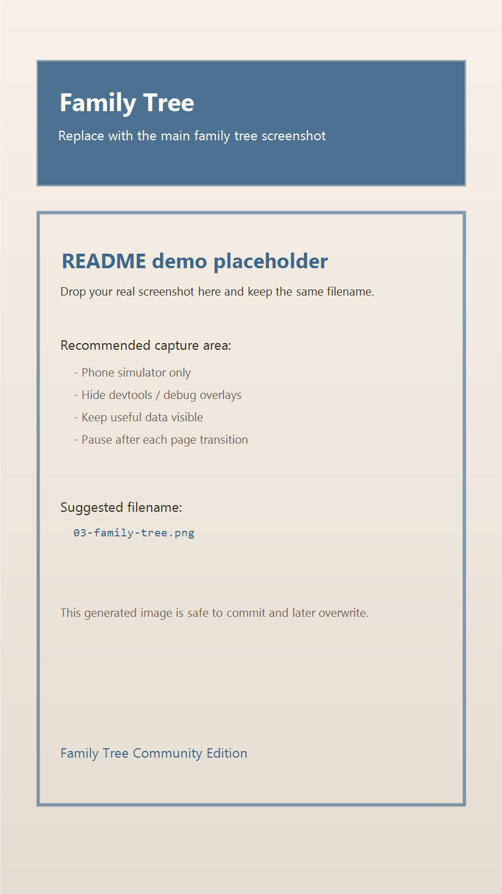
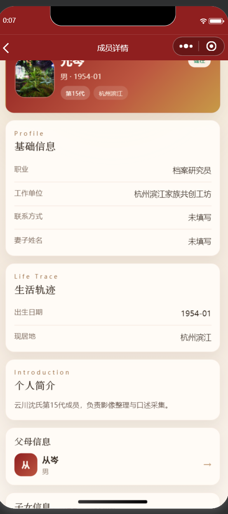
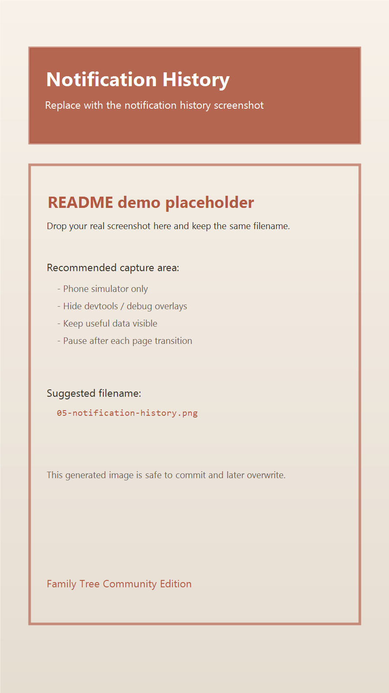
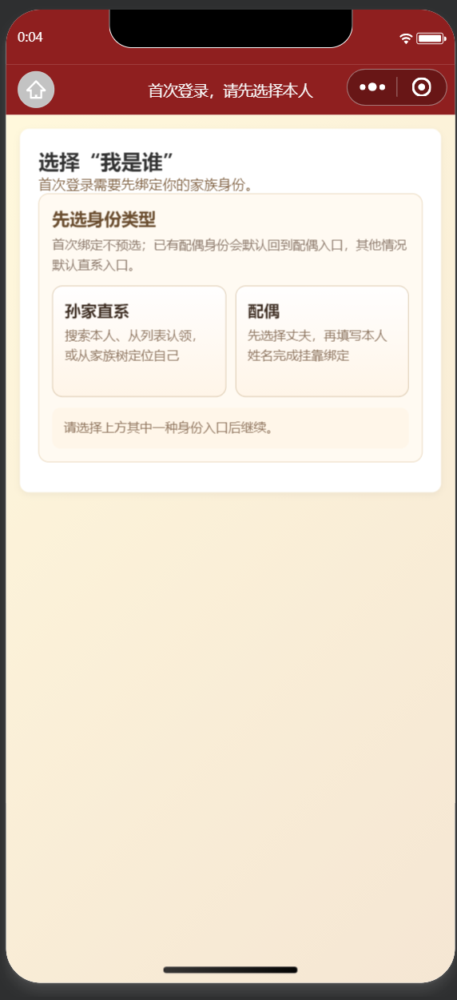
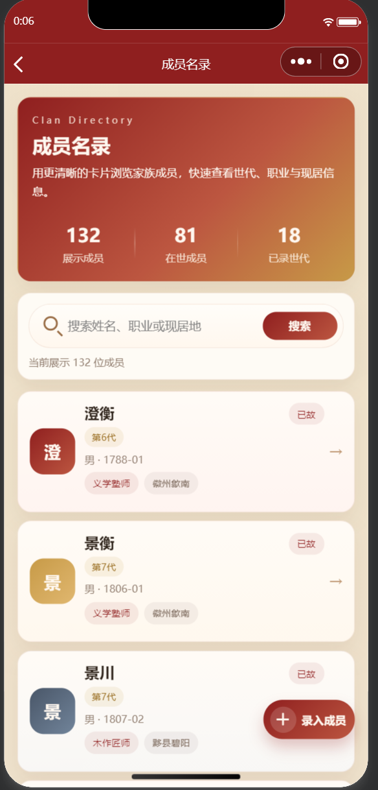
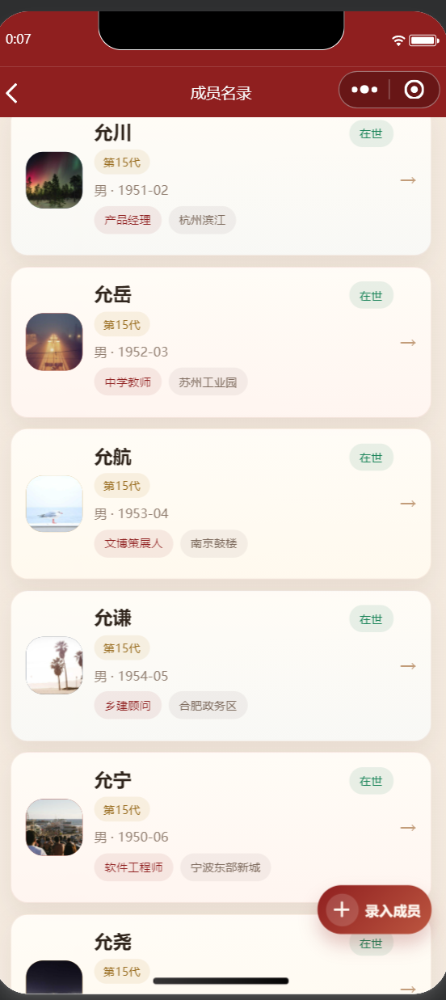

# 族谱小程序社区版

一个面向中国家族谱系场景的单租户族谱小程序社区版。

这个仓库主要用于：

- 展示一个可运行的族谱小程序基础版本
- 提供完整的虚构演示数据，方便本地复现界面效果
- 作为商业授权、私有化部署、定制开发前的技术演示入口

这个仓库**不包含**生产环境凭据、多租户能力、私有导谱工具和商业交付脚本。

## 说明

- 仓库中的成员、地名、迁徙记录、通知和图片均为**虚构演示数据**
- 当前公开版本重点展示前台界面效果
- 微信登录、COS 上传、管理员后台等能力需要你自行补充配置
- 商业授权、私有化部署、定制开发不属于社区版默认能力

当前演示主题使用的是一套虚构数据：

- 家族主题：`云川沈氏·澄源堂`

## 商务咨询

如需商业授权、私有化部署、定制开发或合作咨询，请扫码添加微信沟通。  
添加时请备注：`族谱小程序 / GitHub`。

登录页可以先展示家族迁徙故事，再引导用户进入族谱系统。

首页不仅能看成员，也能承接家族影像和活动记录。

家族树适合快速展示世代关系、主干分支和配偶结构。

成员详情页可以承接职业、地址、简介等长期资料。

通知历史页可用于展示家族公告、祭祀安排和活动提醒。

### 补充截图

首次登录时，可以先完成“我是本人 / 配偶”等身份入口选择。

成员名录总览页适合展示名录规模、搜索入口和列表结构。

成员列表页适合展示世代、职业、现居地等信息的浏览体验。

更多截图建议和录屏脚本见 [docs/SHOWCASE.md](docs/SHOWCASE.md)。

## 项目结构

- `backend/`：Spring Boot 后端
- `miniprogram/`：微信小程序前端
- `backend/src/main/resources/sql/schema_showcase.sql`：演示库结构
- `backend/src/main/resources/sql/seed_showcase.sql`：演示库虚构种子数据
- `docs/SETUP.md`：本地启动说明
- `docs/SHOWCASE.md`：截图与录屏说明
- `docs/RECORDING_SCRIPT.md`：简版录屏顺序

## 快速开始

1. 准备一个 MySQL 8.x 数据库
2. 导入 [schema_showcase.sql](backend/src/main/resources/sql/schema_showcase.sql)
3. 导入 [seed_showcase.sql](backend/src/main/resources/sql/seed_showcase.sql)
4. 在 `backend/` 目录启动后端
5. 用微信开发者工具打开 `miniprogram/`

详细步骤见 [docs/SETUP.md](docs/SETUP.md)。

## 社区版边界

社区版包含：

- 家族树浏览
- 成员列表与详情
- 首页影像展示
- 迁徙时间线
- 通知历史
- 完整虚构演示 SQL

社区版不包含：

- 多租户能力
- 生产环境真实配置
- 运维脚本
- 私有导谱脚本
- 真实家族资料

默认仅保留占位配置的项目：

- 微信小程序配置
- COS 配置
- 邮件配置
- 订阅消息模板配置
- JWT 密钥

## 许可说明

本仓库使用自定义社区版许可证，详见 [LICENSE](LICENSE)。
